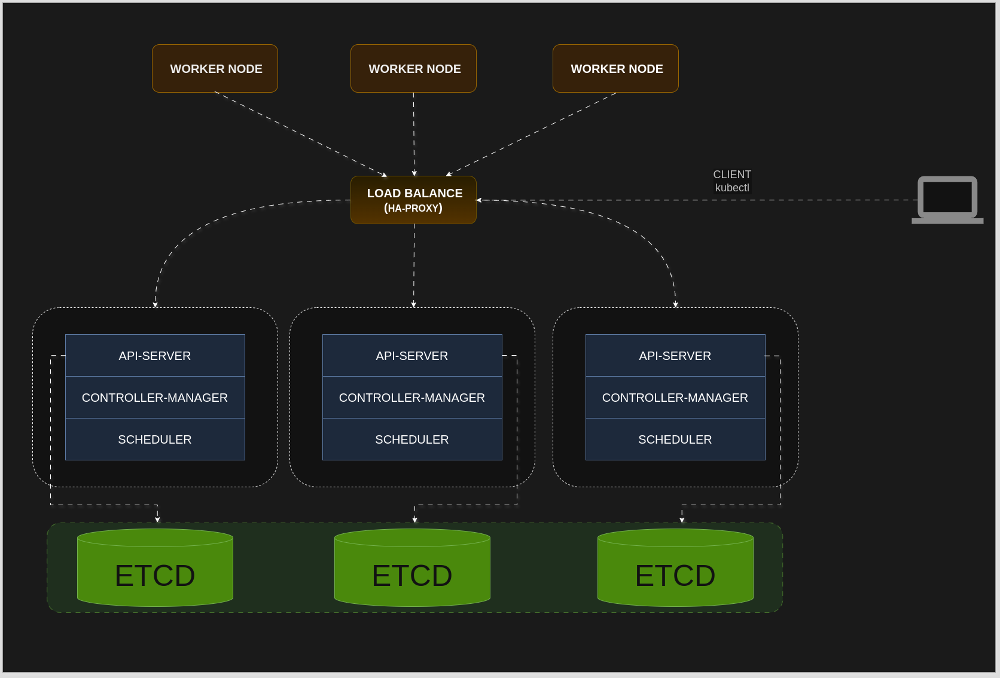

# Hướng dẫn Setup HA External ETCD

<!-- Mục lục -->
1. [Giới thiệu](#giới-thiệu)
2. [Kiến trúc](#kiến-trúc)
3. [Chuẩn bị môi trường](#chuẩn-bị-môi-trường)
4. [General certificate](#chuẩn-bị-môi-trường)
5. [Setup Loadbalance](#setup-loadbalance)
6. [Setup cluster ETCD](#setup-and-config-cluster-etcd)
7. [Setup Kubernetes](#setup-kubernetes)

---

## Giới thiệu

Hướng dẫn này mô tả cách thiết lập **High Availability (HA)** cho **Kubernetes** với **ETCD** dưới dạng External (ngoại vi).  
Bằng cách tách ETCD khỏi các node Master và triển khai nó thành một cluster độc lập, có thể đảm bảo tính sẵn sàng cao, cũng như tránh được rủi ro về “điểm chết” (single point of failure).

## Kiến trúc

Mô hình tổng thể:

- Triển khai một cluster ETCD riêng biệt gồm nhiều node (thường là **3** hoặc **5** node để đảm bảo **quorum**).
- Các node Kubernetes Master (control plane) sẽ trỏ đến ETCD cluster này.
- Nếu một node ETCD gặp sự cố, các node ETCD còn lại vẫn duy trì khả năng đọc/ghi dữ liệu, đảm bảo toàn hệ thống tiếp tục hoạt động ổn định.

<p>
  
</p>

## Chuẩn bị môi trường

|   hostname   |   IP Address  |   CPU  |  Ram   |       OS       |
|:------------:|:-------------:|:------:|:------:|:--------------:|
| etcd-01      | 192.168.56.21 |  2CPU  |   2G   | Oracle linux 9 |
| etcd-02      | 192.168.56.22 |  2CPU  |   2G   | Oracle linux 9 |
| etcd-03      | 192.168.56.23 |  2CPU  |   2G   | Oracle linux 9 |
| master-01    | 192.168.56.31 |  2CPU  |   4G   | Oracle linux 9 |
| master-02    | 192.168.56.32 |  2CPU  |   4G   | Oracle linux 9 |
| worker-01    | 192.168.56.51 |  2CPU  |   2G   | Oracle linux 9 |
| worker-02    | 192.168.56.52 |  2CPU  |   2G   | Oracle linux 9 |
| worker-03    | 192.168.56.53 |  2CPU  |   2G   | Oracle linux 9 |
| loadbalancer | 192.168.56.11 |  2CPU  |   2G   | Oracle linux 9 |

---

## General certificate

1. **Tạo thư mục chứa chứng chỉ ở máy local của bạn**:
  - [File Generate certificate](generate-certificates.sh) `generate-certificates.sh`

## Setup Loadbalance
  - [File Setup Loadbalance](install-haproxy.sh) `install-haproxy.sh`

## Setup and config cluster ETCD

- 1: Setup ETCD
  - [File Setup ETCD](install-etcd.sh) `install-etcd.sh`

  > **NOTE:** Setup:
  - (etcd-01) `192.168.56.21`
  - (etcd-02) `192.168.56.22`
  - (etcd-03) `192.168.56.23`

- 2: Sao chép chứng chỉ đến các node

    ```bash
    scp ca.pem etcd.pem etcd-key.pem root@192.168.56.21:/var/lib/etcd
    scp ca.pem etcd.pem etcd-key.pem root@192.168.56.22:/var/lib/etcd
    scp ca.pem etcd.pem etcd-key.pem root@192.168.56.23:/var/lib/etcd
    ```

- 3:**Tạo Service** `etcd.service` (etcd-01) `192.168.56.21` (etcd-01) `192.168.56.22` (etcd-01) `192.168.56.23`:
  > Note:
    - `--name etcd-01` Tên của node trong cụm etcd
    - `--initial-advertise-peer-urls` URL để cho biết các node khác có thể kết nối qua Ip này
    - `--listen-peer-urls https://192.168.56.21:2380` URL để lắng nghe kết nối từ các node khác trong cụm
    - `--listen-client-urls https://192.168.56.21:2379,https://127.0.0.1:2379` URL để lắng nghe các kết nối từ client
    - `--advertise-client-urls https://192.168.56.21:2379` # URL quảng cáo cho client kết nối
    - `--initial-cluster-token etcd-token` Token nhận diện cụm etcd
    - `--initial-cluster etcd-01=https://192.xx.xx.xx:xxxx,..,..,..` Danh sách các node trong cụm và địa chỉ peer
    - `--log-outputs=/var/lib/etcd/etcd.log` File log của etcd
    - `--initial-cluster-state new` Trạng thái ban đầu của cụm (new/existing)
    - `--peer-auto-tls` Kích hoạt tự động tạo TLS giữa các node trong cụm
    - `--snapshot-count '10000'` Số lượng thay đổi trước khi tạo snapshot
    - `--wal-dir=/var/lib/etcd/wal` Thư mục lưu trữ WAL (Write-Ahead Log)
    - `--client-cert-auth` Kích hoạt xác thực client bằng chứng chỉ
    - `--trusted-ca-file=/var/lib/etcd/ca.pem` File CA dùng để xác thực client
    - `--cert-file=/var/lib/etcd/etcd.pem` File chứng chỉ của etcd server
    - `--key-file=/var/lib/etcd/etcd-key.pem` File khóa riêng của etcd server
    - `--data-dir=/var/lib/etcd/data` Thư mục lưu trữ dữ liệu của etcd
    - `Restart=on-failure` Tự động khởi động lại nếu service gặp lỗi
    - `RestartSec=5` Thời gian chờ trước khi khởi động lại (5 giây)
    - `WantedBy=multi-user.target` Dịch vụ sẽ được khởi động trong chế độ multi-user (chế độ server)

- 4: Kiểm tra hoạt động ETCD

    ```bash
    etcdctl --cacert=/var/lib/etcd/ca.pem --cert=/var/lib/etcd/etcd.pem --key=/var/lib/etcd/etcd-key.pem endpoint health -w=table --cluster
    ```

    ```plaintex
    +----------------------------+--------+------------+-------+
    |          ENDPOINT          | HEALTH |    TOOK    | ERROR |
    +----------------------------+--------+------------+-------+
    | https://192.168.56.21:2379 |   true | 6.781673ms |       |
    | https://192.168.56.23:2379 |   true | 5.884019ms |       |
    | https://192.168.56.22:2379 |   true |  7.83654ms |       |
    +----------------------------+--------+------------+-------+
    ```

### Setup Kubernetes

- 1: Setup Kubernetes `192.168.56.31` `192.168.56.32` `192.168.56.51` `192.168.56.52` `192.168.56.53`
  - [File Setup Kubernetes](install-kube.sh) `install-kube.sh`
  - Chạy script:

      ```bash
      chmod +x install-kube.sh
      ./install-kube.sh
      ```

- 2: Sao chép chứng chỉ đến các node master

    ```bash
    scp ca.pem etcd.pem etcd-key.pem root@192.168.56.31:/etcd/kubernetes/pki/etcd
    scp ca.pem etcd.pem etcd-key.pem root@192.168.56.32:/etcd/kubernetes/pki/etcd
    ```

- 3: Tạo file cấu hình Node master: `sudo touch kubeadm-config.yaml`
  - [File Kubeadm config](kubeadm-config.yaml) `kubeadm-config.yaml`
  - Chạy script:

      ```bash
      kubeadm init --config kubeadm-config.yaml --upload-certs
      ```

  
  Sau chạy câu lệnh `kubeadm init --config kubeadm-config.yml --upload-certs` sẽ generate token để joi các node vào với nhau

  ```plaintex
  token dùng để join control-plane

  kubeadm join 192.168.56.11:6443 --token 9a08jv.*** --discovery-token-ca-cert-hash sha256:*** --control-plane --certificate-key ***

  token dùng để join worker-node

  kubeadm join 192.168.56.11:6443 --token 9a08jv.*** --discovery-token-ca-cert-hash sha256:***
  ```

  Cấu hình `kubectl`

  ```bash
  mkdir -p $HOME/.kube
  sudo cp -i /etc/kubernetes/admin.conf $HOME/.kube/config
  sudo chown $(id -u):$(id -g) $HOME/.kube/config
  ```

  Kiểm tra trạng thái

  ```plaintex
  kubectl get nodes

  NAME        STATUS      ROLES           AGE   VERSION
  master-01   NotReady    control-plane   16h   v1.32.1
  master-2    NotReady    control-plane   16h   v1.32.1
  worker-01   NotReady    <none>          16h   v1.32.1
  worker-02   NotReady    <none>          16h   v1.32.1
  worker-03   NotReady    <none>          16h   v1.32.1
  ```

  Lúc này ta chưa seup network nên các node có trạng thái NotReady
  - trong ví dụ này tôi sẽ dùng mạng cilium

  ``` bash
  helm repo add cilium https://helm.cilium.io/
  helm repo update

  helm install cilium cilium/cilium \
      --namespace kube-system \
      --set ipam.mode=cluster-pool \
      --set clusterPoolIPv4PodCIDR=10.244.0.0/24 \
      --set kubeProxyReplacement=true \
      --set k8sServiceHost=192.168.1.10 \
      --set k8sServicePort=6443
  ```

  - 4: kiểm tra lại các node

  ```plaintex
  kubectl get nodes

  NAME        STATUS      ROLES           AGE   VERSION
  master-01   Ready    control-plane   16h   v1.32.1
  master-2    Ready    control-plane   16h   v1.32.1
  worker-01   Ready    <none>          16h   v1.32.1
  worker-02   Ready    <none>          16h   v1.32.1
  worker-03   Ready    <none>          16h   v1.32.1
  ```
